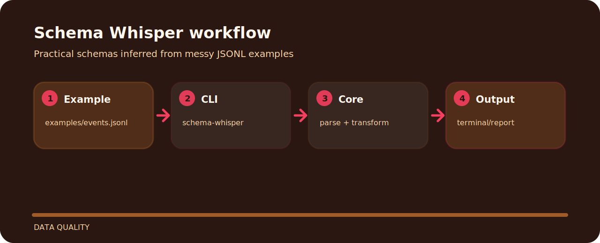

# Schema Whisper


## Project flow



## First run

```bash
git clone https://github.com/mertefekurt/schema-whisper.git
cd schema-whisper
python -m pip install -e ".[dev]"
schema-whisper examples/events.jsonl
schema-whisper examples/events.jsonl --json-schema
```

## Reading notes

Schema Whisper focuses on one practical job in data quality. The README below is arranged around the shortest path from clone to result.

| Detail | Value |
| --- | --- |
| Area | data quality |
| Entry | `schema-whisper` |
| Input | JSONL records |
| Output | readable terminal output |
