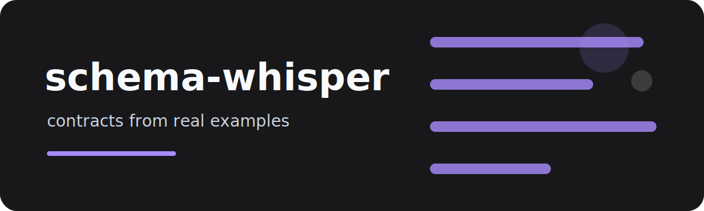

# schema-whisper

`schema-whisper` reads JSONL examples and produces a small contract report: observed field types, optional
fields, example values, and fields that wobble between incompatible types.

It is useful when an LLM, webhook, or event producer claims to return "JSON" but the examples tell a more
complicated story.

## Try it

```bash
schema-whisper examples/events.jsonl
schema-whisper examples/events.jsonl --json-schema
```

## Output style

The default report is for humans:

```text
user_id      string       required
score        number       optional
tags         array        optional
```

The JSON Schema mode is intentionally conservative. If a field appears as both number and string, it keeps
both types visible instead of hiding the instability.

## Project layout

`core.py` handles inference, `cli.py` handles rendering, and tests cover scalar types, optionality,
mixed-type detection, CLI output, and JSON Schema generation.

MIT license.
