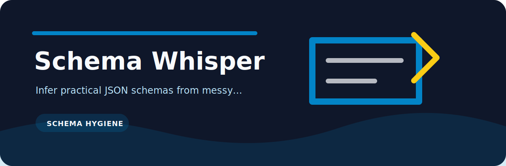

# Schema Whisper

Infer practical JSON schemas from messy JSONL examples.

   

| Question | Answer |
| --- | --- |
| What is it? | A focused Python utility for schema hygiene. |
| How does it run? | `schema-whisper` |
| Why keep it small? | Easier review, easier tests, fewer moving parts. |

## Command

```bash
python -m pip install -e ".[dev]"
schema-whisper examples/events.jsonl
```

## Verify

```bash
python -m pip install -e ".[dev]"
ruff check .
pytest
python -m schema_whisper --help
```
